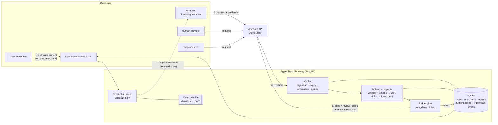

# Agent Trust Gateway

> **Demo prototype.** This is a risk-scoring and authorisation prototype, not production-grade bot detection. It runs locally with SQLite and a demo Ed25519 key. Read [Threat model & limitations](#threat-model--limitations) before drawing conclusions from it.

Agent Trust Gateway sits in front of a merchant's API and answers one question for every request: **who is this, and should we let them do it?** It sorts traffic into three groups:

| Traffic | What it looks like | Typical decision |
|---|---|---|
| **Human** | No agent credential, ordinary browser, normal behaviour | `allow` |
| **Authorised AI agent** | Presents a short-lived credential, signed by the gateway, that the user granted for *this* merchant and *this* scope | `allow` |
| **Suspicious automation** | Missing, forged, expired, revoked or mismatched credential, or bot-like behaviour | `review` / `block` |

Every decision comes with a 0–100 risk score and a list of the factors behind it.

---

## Why this matters

AI agents increasingly shop, search and book on behalf of people. Merchants currently have two poor options:

- **Block all automation.** This also blocks legitimate agents that customers asked for, which loses sales and frustrates users.
- **Allow all automation.** This opens the door to scraping, credential stuffing, scalping and account takeover.

Classic bot detection asks "is this a human?" The better question now is "**is this automation acting with a real user's explicit, scoped, revocable permission?**" This project shows that model working end to end: user-granted authorisation, cryptographically signed short-lived credentials, per-request verification, and an explainable risk decision the merchant can audit.

---

## Architecture



**Request lifecycle** (`POST /api/gateway/evaluate`):

1. **Verify credential** ([app/credentials.py](app/credentials.py)): parse the `atg1.<payload>.<sig>` token and check the Ed25519 signature. Claims from a token with a bad signature are thrown away, including its credential ID.
2. **Check registry state** ([app/services/gateway.py](app/services/gateway.py)): look up the credential; decide whether it is active, expired or revoked. The signed `exp` is authoritative.
3. **Match claims**: compare the request's merchant, user and agent against the credential, and the action against its scope.
4. **Collect behaviour** ([app/risk/behaviour.py](app/risk/behaviour.py)): read recent events for velocity, recent failures, IP/user-agent drift and many-accounts-per-IP.
5. **Score** ([app/risk/engine.py](app/risk/engine.py)): a pure function turns `RiskSignals` into a score, a decision and a list of factors.
6. **Persist** an event (never the token) and return the structured decision.

### Repository layout

```
app/
  main.py              app factory, CORS, access logging, static files
  config.py            env-driven settings (ATG_*)
  crypto.py            Ed25519 key load/generate (demo-only, file-based)
  credentials.py       token format: issue / verify (pure)
  risk/engine.py       deterministic scoring: weights, thresholds (pure, swappable)
  risk/behaviour.py    history-based signals from the events table
  services/            gateway orchestration, registry, demo scenarios, seed
  routers/             HTTP endpoints
  static/              dashboard (vanilla HTML/CSS/JS)
tests/                 unit, service and end-to-end API tests
scripts/simulate_agent.py   stdlib-only CLI agent that calls the merchant API
```

---

## Quick start

**Local (Python 3.11+; check `python3 --version`, since some macOS installs default to 3.9):**

```bash
python3.12 -m venv .venv && source .venv/bin/activate
pip install -r requirements.txt
uvicorn app.main:app --reload
```

Open **http://localhost:8000** for the dashboard, or **http://localhost:8000/docs** for interactive API docs.

On first start the app creates `data/` containing the SQLite database and a demo signing key, then seeds DemoShop, Alex Tan, Shopping Assistant, an active `browse`+`search` authorisation, and a set of example allow/review/block events. To start over, delete `data/`.

**Docker:**

```bash
docker compose up --build
```

**Tests:**

```bash
pytest
```

**Configuration** (environment variables):

| Variable | Default | Purpose |
|---|---|---|
| `ATG_DATA_DIR` | `data` | Location of the DB and key file |
| `ATG_DATABASE_URL` | `sqlite:///data/agent_trust.db` | SQLAlchemy URL |
| `ATG_KEY_PATH` | `data/demo_ed25519_private.pem` | Demo signing key |
| `ATG_CREDENTIAL_TTL_SECONDS` | `900` | Default credential lifetime |
| `ATG_SEED_DEMO_DATA` | `true` | Seed on first start |
| `ATG_CORS_ORIGINS` | `http://localhost:8000,...` | Comma-separated allowed origins |
| `ATG_LOG_LEVEL` | `INFO` | JSON log level |

---

## Demo walkthrough

1. **Open the dashboard.** The overview cards show the seeded traffic. The *Recent events* table already contains allow, review and block examples; click any row to see its score gauge and the factors behind it.
2. **Run the one-click scenarios**, ideally in order:

   | # | Scenario | Expected | What it demonstrates |
   |---|---|---|---|
   | 1 | Legitimate authorised agent | **allow** (0) | Valid signature, active, in scope, declared agent |
   | 2 | Human shopper | **allow** (25) | No credential needed for normal browsing |
   | 3 | Expired credential | **block** (70) | Short-lived credentials cannot be replayed later |
   | 4 | Revoked credential | **block** (80) | User revocation takes effect immediately |
   | 5 | Invalid signature | **block** (75) | Agent edits its own scope; Ed25519 catches it |
   | 6 | High-velocity suspicious agent | review → **block** | 25-request burst across accounts; see the per-request sequence escalate |
   | 7 | Unauthorised scope | **review** (65) | Valid agent tries `purchase`; needs step-up approval |
   | 8 | Credential replay on another account | **block** (70) | Credential is bound to one user |

3. **Authorise an agent yourself.** In *Authorise an agent*, pick scopes and a lifetime and submit. The signed token is shown once and loaded into the simulator automatically.
4. **Simulate requests.** Send `search` (allowed) and then `purchase` (review). Switch the user-agent preset to *Scraper*, clear the credential, set *Repeat* to 20 and watch velocity push the score up.
5. **Revoke.** Click *Revoke* in the *Credentials* table and resend the same request: it is now blocked with `credential_revoked`.
6. **From the terminal:** `python scripts/simulate_agent.py` plays a full agent session against the protected merchant endpoint, which returns HTTP 200, 428 or 403.

---

## API examples

All errors share one envelope: `{"error": {"code", "message", "details"}}`.

```bash
# Health
curl -s localhost:8000/health

# Dashboard summary
curl -s localhost:8000/api/dashboard/summary

# Create a user and a merchant
curl -s -X POST localhost:8000/api/users -H 'Content-Type: application/json' \
  -d '{"name": "Sam Lee", "email": "sam@example.com"}'
curl -s -X POST localhost:8000/api/merchants -H 'Content-Type: application/json' \
  -d '{"name": "Acme Outdoors"}'

# Authorise the Shopping Assistant for Alex at DemoShop -> returns a signed credential
curl -s -X POST localhost:8000/api/authorisations -H 'Content-Type: application/json' -d '{
  "user_id": "usr_alex_tan", "merchant_id": "mer_demoshop",
  "agent_id": "agt_shopping_assistant", "scopes": ["browse", "search"], "ttl_seconds": 900
}'
# -> {"authorisation": {...}, "issued": {"token": "atg1.eyJ...", "credential": {"id": "cred_..."}, "claims": {...}}}

TOKEN=atg1....   # from the response above

# Evaluate a request
curl -s -X POST localhost:8000/api/gateway/evaluate -H 'Content-Type: application/json' -d "{
  \"credential\": \"$TOKEN\",
  \"merchant_id\": \"mer_demoshop\", \"user_id\": \"usr_alex_tan\", \"agent_id\": \"agt_shopping_assistant\",
  \"action\": \"search\", \"ip_address\": \"203.0.113.10\",
  \"user_agent\": \"ShoppingAssistant/1.0\", \"declared_agent\": true,
  \"metadata\": {\"query\": \"trail shoes\"}
}"
```

Response:

```json
{
  "event_id": "evt_3f6c0a1b9d2e4f58",
  "decision": "allow",
  "risk_score": 0,
  "base_score": 25,
  "classification": "authorised_agent",
  "identity_status": "verified_agent",
  "authorisation_status": "authorised",
  "credential_status": "active",
  "credential_id": "cred_58f59c209342c55d",
  "risk_factors": [
    {"code": "verified_credential", "points": -20, "description": "Valid signature, active credential, claims match, scope granted"},
    {"code": "transparent_agent", "points": -5, "description": "Agent openly declared itself and presented a verified credential"}
  ],
  "evaluated_at": "2026-09-25T00:09:47Z"
}
```

```bash
# Revoke a credential
curl -s -X POST localhost:8000/api/credentials/cred_58f59c209342c55d/revoke \
  -H 'Content-Type: application/json' -d '{"reason": "User withdrew consent"}'

# List credentials / events
curl -s 'localhost:8000/api/credentials?status=active'
curl -s 'localhost:8000/api/events?decision=block&limit=10'
curl -s localhost:8000/api/events/evt_3f6c0a1b9d2e4f58

# Mint a fresh short-lived credential from the seeded authorisation
curl -s -X POST localhost:8000/api/authorisations/auth_alex_shopping_assistant/credentials

# Call the sample protected merchant API (200 allow / 428 review / 403 block)
curl -si -X POST localhost:8000/api/merchant/mer_demoshop/search \
  -H "Authorization: AgentCredential $TOKEN" -H 'X-Agent-Id: agt_shopping_assistant' \
  -H 'X-User-Id: usr_alex_tan' -H 'X-Declared-Agent: true'

# Run a demo scenario
curl -s -X POST localhost:8000/api/demo/scenarios/high_velocity

# Verifier public key
curl -s localhost:8000/api/keys/public
```

### Endpoint reference

| Method | Path | Purpose |
|---|---|---|
| GET | `/health` | Liveness, DB check, signing key ID |
| GET | `/api/dashboard/summary` | Totals by decision, credential states, classification |
| POST/GET | `/api/users` | Create / list users |
| POST/GET | `/api/merchants` | Create / list merchants |
| POST/GET | `/api/agents` | Register / list agents |
| POST/GET | `/api/authorisations` | Grant an agent scopes (issues a credential) / list |
| POST | `/api/authorisations/{id}/credentials` | Mint a fresh short-lived credential |
| GET | `/api/credentials?status=` | List credentials (never includes tokens) |
| POST | `/api/credentials/{id}/revoke` | Revoke a credential |
| POST | `/api/gateway/evaluate` | Score a request and return a decision |
| GET | `/api/events`, `/api/events/{id}` | Decision log |
| POST | `/api/merchant/{merchant_id}/{action}` | Sample protected endpoint that enforces the decision |
| GET/POST | `/api/demo/scenarios[/{key}]` | List / run one-click scenarios |
| GET | `/api/keys/public` | Ed25519 verification key |

---

## Risk scoring

The engine ([app/risk/engine.py](app/risk/engine.py)) is a **pure, deterministic function**: `assess(RiskSignals) -> RiskAssessment`. It performs no I/O, so the same inputs always give the same score. That makes it easy to test exhaustively and easy to replace later with a learned model that uses the same interface.

**Algorithm:** start at a neutral **25**, add or subtract the points for every signal that fires, clamp to **0–100**, then apply thresholds:

| Score | Decision | Meaning |
|---|---|---|
| 0–39 | `allow` | Serve the request |
| 40–69 | `review` | Challenge: step-up auth, CAPTCHA or manual review |
| 70–100 | `block` | Reject |

The neutral start of 25 sits inside the allow band on purpose: ordinary human traffic with no suspicious signals is allowed and needs no credential. Trust goes **down** from there only with proof (a fully verified credential) and goes **up** with each piece of evidence.

| Signal | Points | Fires when |
|---|---:|---|
| `verified_credential` | **−20** | Signature valid, credential active, merchant/user/agent match, scope granted, agent registered |
| `transparent_agent` | **−5** | Verified *and* `declared_agent: true` |
| `malformed_credential` | +50 | Token cannot be parsed |
| `invalid_signature` | +50 | Ed25519 check fails (tampered or foreign key) |
| `unknown_credential` | +40 | Validly signed but not in the registry |
| `credential_revoked` | +55 | Revoked in the registry |
| `credential_expired` | +45 | `now >= exp` |
| `unknown_agent` | +30 | Agent ID not registered |
| `agent_mismatch` | +35 | Request agent ≠ credential agent |
| `merchant_mismatch` | +45 | Credential issued for a different merchant |
| `user_mismatch` | +45 | Credential issued for a different user |
| `scope_not_granted` | +40 | Action not in credential scope |
| `undeclared_agent_with_credential` | +10 | Presents an agent credential but claims not to be an agent |
| `declared_agent_without_credential` | +25 | Claims to be an agent but shows no credential |
| `automation_user_agent` | +30 | Scripting/headless UA, no credential, not declared |
| `velocity_elevated` / `_high` / `_extreme` | +25 / +40 / +55 | ≥11 / ≥21 / ≥41 prior requests in 60 s (per credential, else per IP) |
| `repeated_failures` / `_high` | +15 / +25 | ≥3 / ≥6 review-or-block outcomes in 5 min (same IP or credential) |
| `ip_change` | +15 | Credential seen from a new IP in the last 30 min |
| `user_agent_change` | +10 | Credential seen with a new UA in the last 30 min |
| `many_accounts_from_ip` / `_high` | +25 / +40 | ≥3 / ≥6 distinct user accounts from one IP in 10 min |

Only the highest tier of each tiered signal fires. The weights are chosen so that the following guarantees hold, and the tests check each one:

- Any expired, revoked, forged or malformed credential **always blocks** (≥ 70), because the verification bonus is withheld.
- Merchant or user mismatch **always blocks**.
- A scope violation on an otherwise valid credential lands in **review** (step-up), and escalates to block if repeated.
- A verified agent that bursts past 20 req/min drops to **review**.
- Ordinary human traffic scores **25** (allow).

---

## Threat model & limitations

**In scope (what the prototype defends against):**

| Threat | Mitigation |
|---|---|
| Agent forging or editing its own credential | Ed25519 signature over canonical claims; tampering → `invalid_signature` |
| Replaying a stolen credential later | 15-minute default lifetime; `exp` is signed |
| User withdrawing consent | Immediate revocation checked on every request |
| Using a credential at another merchant or on another account | `mid` and `sub` claims are bound and compared |
| Scope escalation (e.g. browse → purchase) | Per-action scope check → review/step-up |
| Unauthorised scrapers, credential stuffing, enumeration | Velocity, repeated-failure and multi-account-per-IP signals |
| Session hijack of a live credential | IP/user-agent drift signals |

**Explicit limitations. Do not rely on this in production:**

- **No proof-of-possession.** A token stolen in transit can be used from anywhere until it expires or is revoked. Only the IP/UA drift signals push back, and weakly. Production needs DPoP or mTLS-bound tokens.
- **Self-reported inputs.** `ip_address`, `user_agent` and `declared_agent` are provided by the caller of `/evaluate`. A real deployment derives them at the edge (TLS termination, trusted proxy headers).
- **Human detection is trivial.** "Presumed human" just means "no credential and no automation signals". There is no device fingerprinting, behavioural biometrics or CAPTCHA. A careful bot that spoofs a browser UA at low volume will be scored as human.
- **IP-based signals are coarse.** NAT, mobile carriers and VPNs cause false positives and false negatives. Botnets with residential proxies evade them.
- **Demo key management.** A single Ed25519 key sits in a local PEM file (mode 0600), with no rotation, no KMS/HSM and no JWKS-style key set. It is never stored in the DB or logged, but anyone with filesystem access can mint credentials.
- **No authentication on the management API.** Anyone who can reach the server can create authorisations or revoke credentials. There is no user consent screen: the dashboard stands in for one.
- **Hand-tuned weights.** They are illustrative, not calibrated on real traffic.
- **SQLite and synchronous history queries.** Fine for a demo; a real gateway needs an in-memory counter store (e.g. Redis) and sub-millisecond decisions.
- **Custom token format.** It is JWT-like but not a standard. A production version should use JWS/JWT, Biscuit, or W3C Verifiable Credentials.

**Security hygiene that *is* implemented:** tokens are returned once and never persisted or logged (tests assert this); log context redacts `credential`/`token`/`signature` keys; validation errors never echo submitted values; all input is validated with Pydantic; CORS is restricted to local origins.

---

## Design decisions

- **Authorisation vs credential.** An *authorisation* is the user's standing grant (user × merchant × agent × scopes). A *credential* is a short-lived signed token minted from it. This mirrors OAuth refresh/access tokens and keeps revocation cheap.
- **Stateless verification plus a stateful revocation check.** The signature and expiry can be verified offline with the public key (`/api/keys/public`). Revocation needs the registry, and the gateway checks it on every request.
- **Distrust unverified claims completely.** If the signature fails, the gateway uses nothing from the token, not even the credential ID. This stops attackers from poisoning another credential's behavioural history.
- **The engine is pure; signal gathering is not.** `risk/engine.py` has no imports from the DB layer. A learned model can replace `assess()` without touching the gateway.
- **Evaluate returns 200 with a decision.** The caller enforces it. The sample merchant endpoint shows enforcement by mapping allow/review/block to 200/428/403.

---

## Future extensions

- **Device and network reputation**: device attestation (Apple App Attest, Play Integrity), ASN and residential-proxy reputation, JA4 TLS fingerprints.
- **Privacy-preserving identity**: Privacy Pass / Private Access Tokens for human attestation without tracking, and selective-disclosure credentials (SD-JWT, BBS+) so agents prove "authorised by a verified customer" without revealing who.
- **mTLS and proof-of-possession**: bind credentials to agent keys (DPoP, RFC 8705 mTLS), and use Web Bot Auth / HTTP Message Signatures so agents sign each request.
- **OAuth 2.1 / OIDC**: replace the dashboard grant with a real consent flow (Rich Authorization Requests, CIBA for step-up on `review`), with the gateway acting as an OAuth resource server.
- **Model-based detection**: train a gradient-boosted or sequence model on labelled events, keeping the rules as guardrails and hard constraints, with SHAP-style explanations to preserve auditability.
- **Continuous red-team testing**: a scenario library of adversarial agents (low-and-slow scraping, token theft, prompt-injected agents overstepping scope) run in CI, with precision/recall tracked per release.
- **Operations**: key rotation with a JWKS endpoint, Redis sliding-window counters, per-merchant policy configuration, webhooks on block, and an audit export.

---

*License: demo code, provided as-is for evaluation and discussion.*
